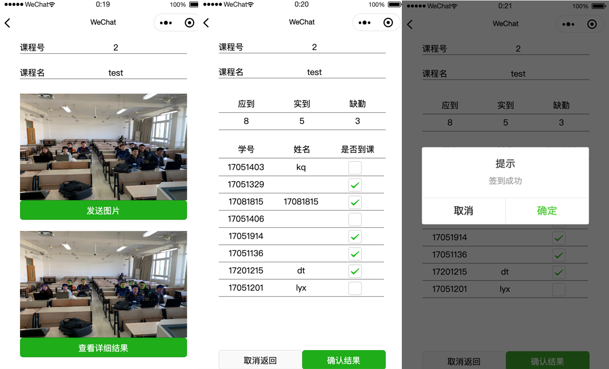
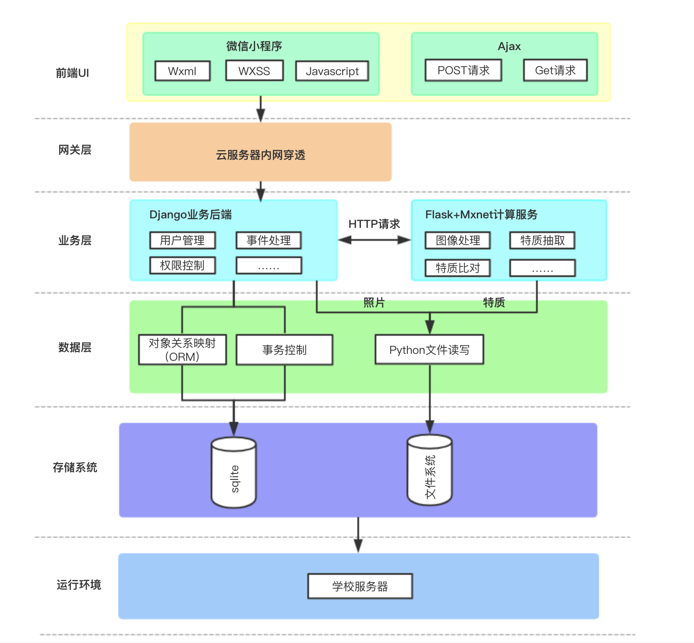

# SamaritanHDU

## Intro

课程项目，利用人脸识别技术和微信小程序平台实现的课堂点名系统，效果如图

	

核心开发人员为[@ParadoxSZW](https://github.com/ParadoxZW)和[iris19990802](https://github.com/iris19990802)

## Implementation

本系统的架构如图所示

	

更多技术细节请阅读`resource/doc.pdf`.

## Appreciate

感谢[Insightface](https://github.com/deepinsight/insightface)提供的代码和模型。